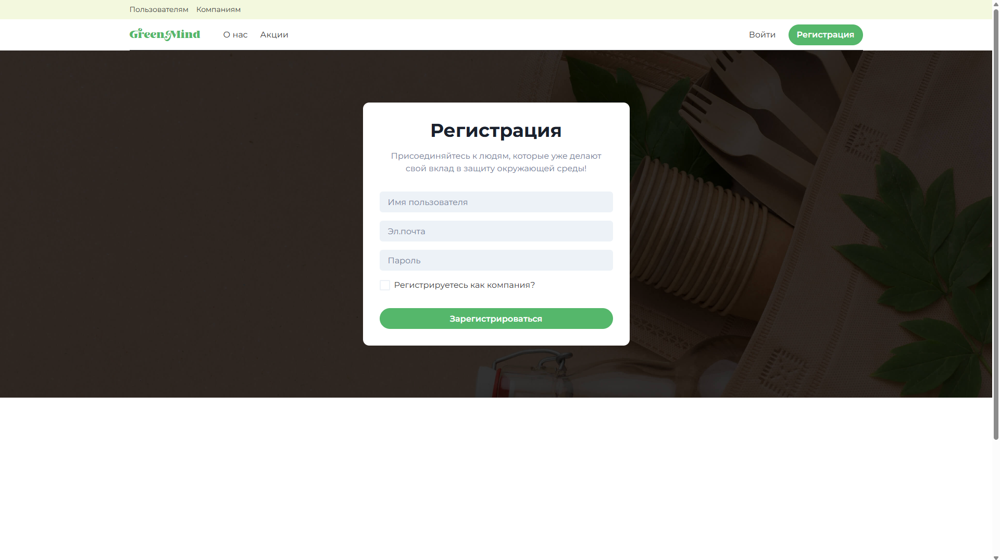
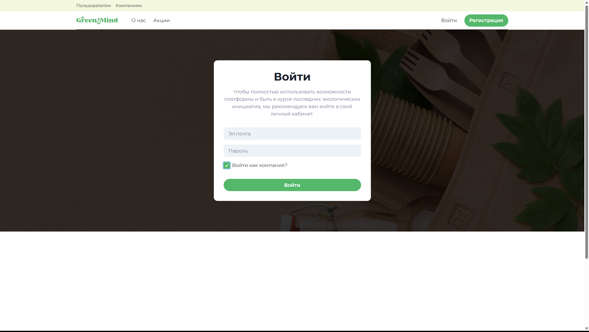
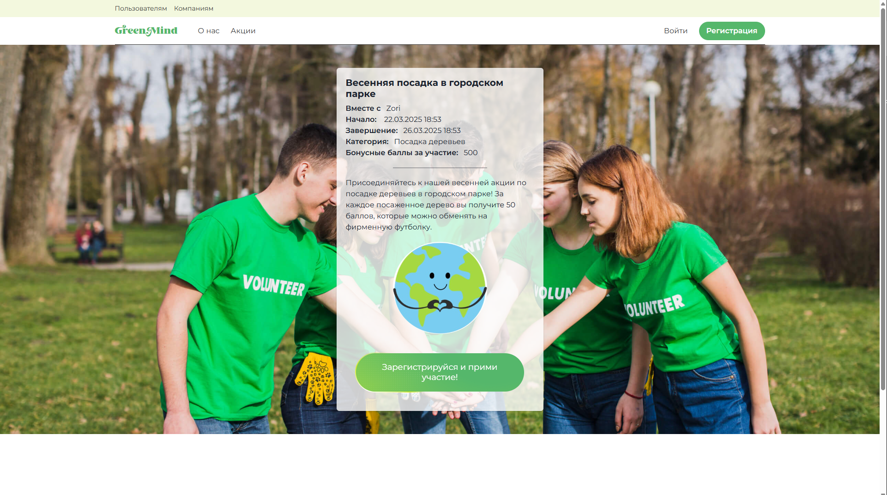
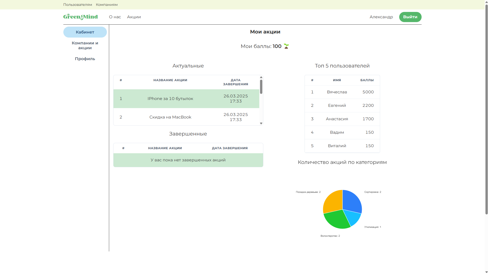
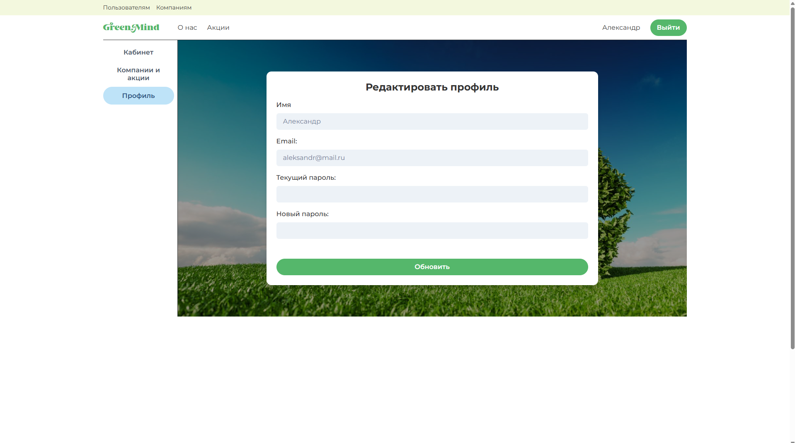
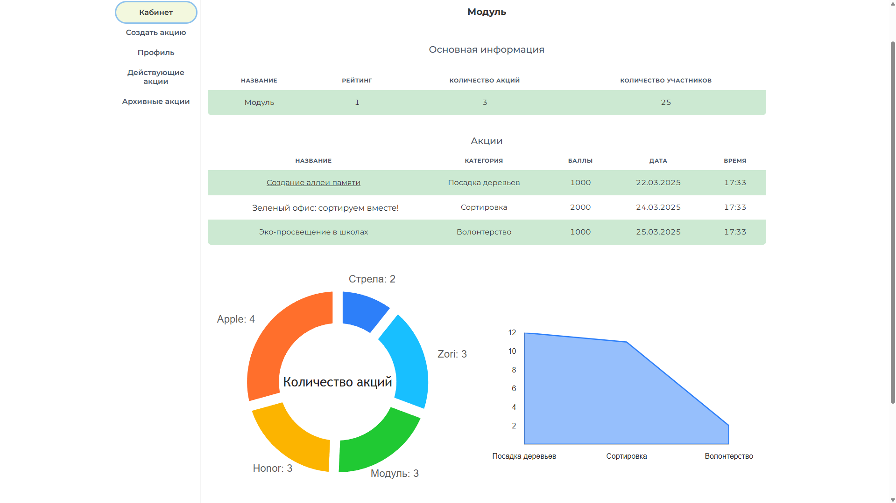
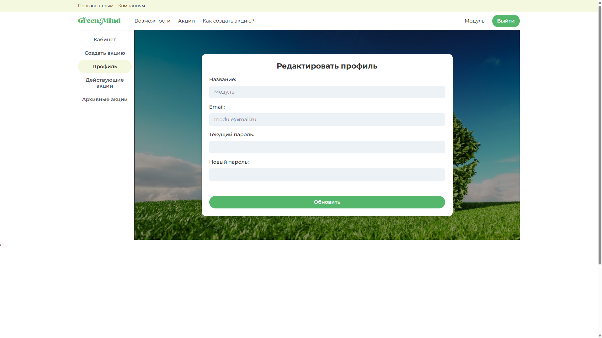
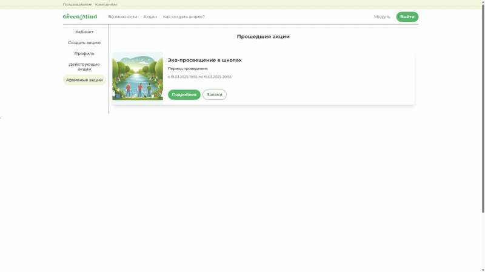

# GreenMind - Платформа для устойчивого развития и охраны окружающей среды

GreenMind - это веб-платформа, объединяющая пользователей и бизнес в целях устойчивого развития и охраны окружающей среды.  Платформа предоставляет инструменты для поиска и участия в экологических акциях, организации собственных инициатив и обмена опытом.

**Основные возможности:**

1. **Общий доступ (для всех пользователей и компаний)**

*   **Главная страница для пользователей:** Знакомство с платформой через динамичный параллакс-эффект, подробная информация о миссии GreenMind, ключевых достижениях и вдохновляющая карусель экологических акций.
    <p align="center" width="100%">
       
    </p>
*   **Главная страница для компаний:** Обзор преимуществ GreenMind для компаний, описание возможностей для продвижения экологических инициатив и пошаговое руководство по созданию собственных акций.
    <p align="center" width="100%">
       
    </p>
*   **Страницы регистрации и авторизации:** Быстрая и простая регистрация или вход на платформу с возможностью выбора роли (пользователь или компания).
    <p align="center" width="100%">
       
       
    </p>
*    **Страница акций :** Предварительный просмотр избранных экологических акций в карусели на главной странице, доступный для всех посетителей.  Для участия в акциях и получения полного доступа к платформе необходимо зарегистрироваться.
    <p align="center" width="100%">
       
    </p>

2. **Личный кабинет пользователя**

*   **Кабинет:** Обзор персональной статистики и активностей.
    <p align="center" width="100%">
       
    </p>
    <ul>
        <li><strong>Мои акции:</strong> Список текущих и завершенных экологических акций, в которых вы принимаете участие.</li>
        <li><strong>Мой вклад:</strong> Наглядное отображение накопленных баллов за ваши экологические действия.</li>
        <li><strong>Лидеры GreenMind:</strong> Топ-5 самых активных участников платформы.</li>
        <li><strong>Статистика участия:</strong> Интерактивная диаграмма, показывающая ваше участие в акциях по категориям.</li>
    </ul>
    
*   **Компании и акции:** Поиск и участие в экологических инициативах.
    <p align="center" width="100%">
       
    </p>
    <ul>
        <li>Информация о выбранной компании (название, рейтинг, количество акций, количество участников).</li>
        <li>Список акций компании (название, категория, баллы, дата начала/окончания).</li>
        <li>Диаграмма "Топ-5 компаний по количеству акций".</li>
        <li>Диаграмма "Количество участников акций по категориям" (от выбранной компании).</li>
        <li>При наведении на название компании , название увелививается и смещается немного вправо</li>
        <li>Если пользователь участвует в акции то акция имеет черный цвет а не белый</li>
        <li>При нажатие на название акции , перенаправляет на страницу акции</li>
    </ul>

*   **Профиль:**  Управление личными данными и настройками аккаунта.
    <p align="center" width="100%">
       
    </p>

3. **Для компаний (дашборд)**

*   **Вкладка "Кабинет":**
    <p align="center" width="100%">
       
    </p>
    <ul>
        <li>Название компании и основная информация.</li>
        <li>Таблица с информацией о компании (название, рейтинг, количество акций, количество участников).</li>
        <li>Таблица со списком акций компании (название, категория, баллы, дата и время).</li>
        <li>Диаграмма "Топ-5 компаний по количеству акций".</li>
        <li>Диаграмма "Количество участников акций по категориям" (от компании).</li>
    </ul>

*   **Вкладка "Создать акцию":** Форма для создания акции (название, дата проведения, категория, описание, баллы, фото).
    <p align="center" width="100%">
       
    </p>

*   **Вкладка "Профиль":** Изменение названия, почты и пароля.
    <p align="center" width="100%">
       
    </p>

*   **Вкладка "Действующие акции":** Список действующих акций с информацией (название, период) и кнопками "Подробнее", "Редактировать", "Удалить".
    <p align="center" width="100%">
       
    </p>

*   **Вкладка "Архивные акции":** Список прошедших акций с информацией (название, период) и кнопками "Подробнее" и "Заявки".  На странице "Заявки" - списки участников (подтвержденные и неподтвержденные) с возможностью подтверждения/отмены участия.
    <p align="center" width="100%">
       
    </p>

## Технологии

*   **Frontend:**
    *   React.js
    *   React Router DOM
    *   Redux Toolkit
    *   Axios
    *   Chakra UI
    *   Framer Motion
    *   React Hook Form
    *   React Icons
    *   Swiper
    *   Victory
    *   Vite
    *   TypeScript

*   **Backend:**
    *   Node.js
    *   Express.js
    *   Sequelize
    *   PostgreSQL
    *   bcrypt
    *   cookie-parser
    *   cors
    *   dotenv
    *   jsonwebtoken
    *   morgan
    *   multer

## Требования

*   Наличие установленной СУБД PostgreSQL на устройстве.

## Настройка и запуск

1.  **Клонируйте репозиторий:**
    ```bash
    git clone [URL вашего репозитория]
    cd [название директории репозитория]
    ```

2.  **Настройте переменные окружения:**
    *   Создайте файл `.env` в корне проекта.
    *   Заполните его, используя пример из `env.example` (как для сервера, так и для клиента, строго соблюдая формат).

3.  **Установите зависимости:**
    ```bash
    npm install # (для сервера и клиента)
    ```

4.  **Настройте и запустите базу данных:**
    ```bash
    npm run db:reset # (для сервера)
    ```

5.  **Запустите приложение в режиме разработки:**
    ```bash
    npm run dev # (для сервера и клиента)
    ```

6.  **Откройте приложение в браузере:**
    Перейдите по адресу `http://localhost:5173`

## Авторизация для тестирования

*   **Пользователь:**
    *   **Email:** `aleksandr@mail.ru`
    *   **Пароль:** `12345`
*   **Компания:**
    *   **Email:** `module@mail.ru`
    *   **Пароль:** `12345`
